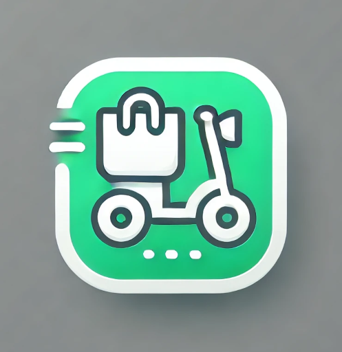
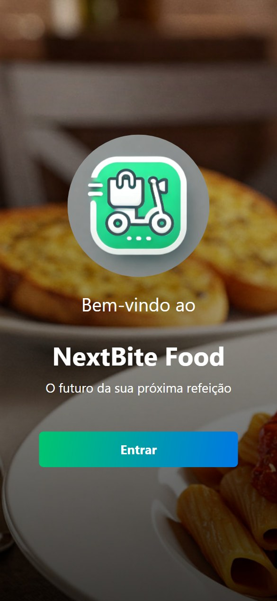
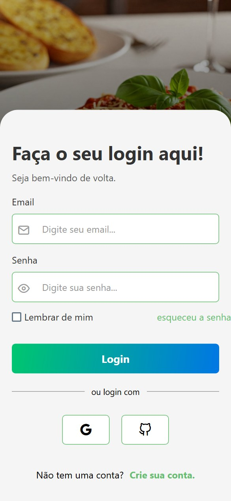
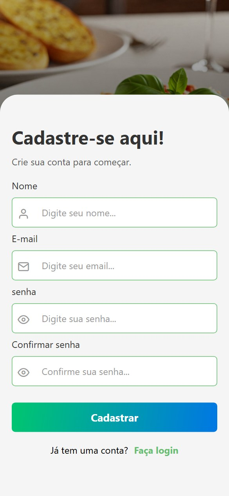
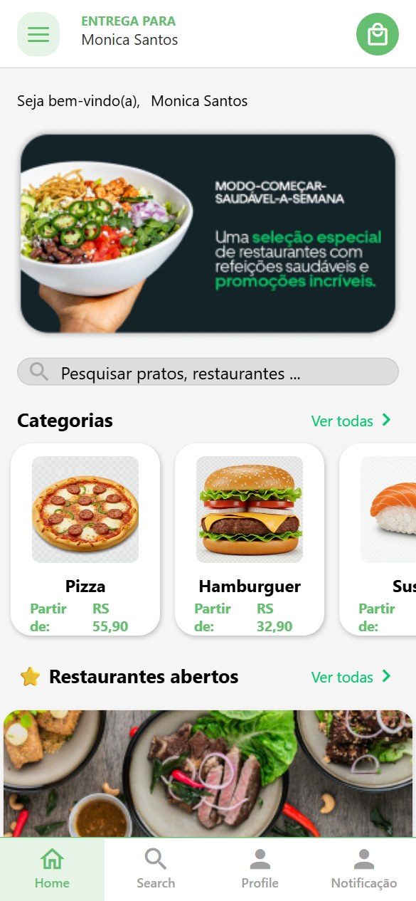
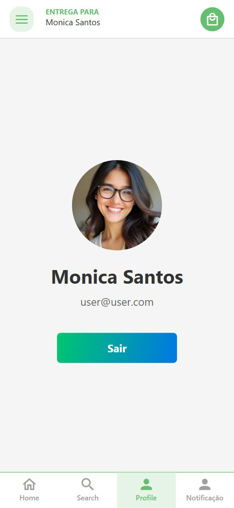

# 🍔 NextBite Food

<p align="center">
  
</p>

<p align="center">
  <strong>O futuro da sua próxima refeição.</strong><br/>
  Aplicativo mobile de delivery de comida construído com React Native e Expo.
</p>

<p align="center">
  
  
  
  
</p>

---

## 📱 Sobre o projeto

**NextBite Food** é um aplicativo de delivery de comida em desenvolvimento, criado como projeto de estudo do curso **LAB365**. O app simula a jornada completa de um usuário em uma plataforma de delivery: apresentação inicial, autenticação, navegação por restaurantes e categorias, e gerenciamento de perfil.

O foco do projeto é aplicar, na prática, conceitos essenciais do ecossistema React Native/Expo: navegação em pilha e abas, gerenciamento de estado global via Context API, formulários controlados com validação robusta e persistência de sessão local.

## 📸 Screenshots

<p align="center">
  
  
  
  
  
</p>

<p align="center">
  <em>Entrada · Login · Cadastro · Home · Perfil</em>
</p>

## ✨ Funcionalidades

- **Onboarding** — tela de entrada com identidade visual da marca
- **Autenticação** — login e cadastro com validação de formulário em tempo real (Zod + React Hook Form)
- **Sessão persistente** — dados do usuário armazenados localmente com `AsyncStorage`, mantendo o login entre sessões do app
- **Feedback visual** — notificações toast para sucesso/erro em ações como login e logout
- **Home** — banner de destaque, busca, categorias em carrossel e lista de restaurantes abertos
- **Navegação condicional** — fluxo público (não autenticado) e fluxo autenticado com abas, alternados automaticamente conforme o estado de login
- **Perfil do usuário** — visualização de dados da conta e logout

## 🛠️ Tecnologias

| Categoria | Tecnologias |
|---|---|
| **Core** | [React Native](https://reactnative.dev/) 0.79 · [Expo](https://expo.dev/) SDK 53 · [TypeScript](https://www.typescriptlang.org/) |
| **Navegação** | React Navigation (Native Stack, Bottom Tabs, Material Top Tabs) |
| **Formulários & validação** | React Hook Form · Zod · @hookform/resolvers |
| **Estado & persistência** | Context API · AsyncStorage |
| **UI/UX** | Expo Linear Gradient · Expo Checkbox · Vector Icons · React Native Toast Message |

## 📂 Estrutura do projeto

```
src/
├── components/     # Componentes reutilizáveis (forms, cards, headers, inputs...)
├── constants/      # Dados mockados e paleta de cores
├── contexts/       # Context API (autenticação)
├── hook/           # Hooks customizados (useAuth)
├── navigation/      # Pilhas e abas de navegação (público, autenticado, root)
├── screens/        # Telas do aplicativo
├── service/        # Camada de acesso ao AsyncStorage
├── styles/         # Estilos organizados por tela/componente
└── types/          # Tipagens compartilhadas
```

## 🚀 Como executar

### Pré-requisitos

- [Node.js](https://nodejs.org/) 18 ou superior
- npm
- App **Expo Go** no celular ([Android](https://play.google.com/store/apps/details?id=host.exp.exponent) / [iOS](https://apps.apple.com/app/expo-go/id982107779)) ou um emulador Android/iOS configurado

### Instalação

```bash
# Clone o repositório
git clone https://github.com/mrcomputer2018/expo-lab365-food-delivery.git

# Acesse a pasta do projeto
cd expo-lab365-food-delivery

# Instale as dependências
npm install
```

### Executando o app

```bash
npm start        # Inicia o Metro bundler e exibe o QR Code (Expo Go)
npm run android  # Executa em um emulador/dispositivo Android
npm run ios      # Executa em um simulador/dispositivo iOS
npm run web      # Executa no navegador
```

### 🔑 Login de demonstração

O app utiliza autenticação mockada. Use as credenciais abaixo para acessar a área logada:

```
email: user@user.com
senha: 12345678
```

## 🗺️ Roadmap

- [ ] Integração com API real de restaurantes e pedidos
- [ ] Carrinho de compras e checkout
- [ ] Busca funcional com filtros por categoria
- [ ] Autenticação real com backend
- [ ] Tela de detalhes do restaurante

## 👤 Autor

Desenvolvido por **Marcelo Ribeiro** como parte do curso **LAB365**.

- GitHub: [@mrcomputer2018](https://github.com/mrcomputer2018)

---

<p align="center">Feito com 💚 e React Native</p>
